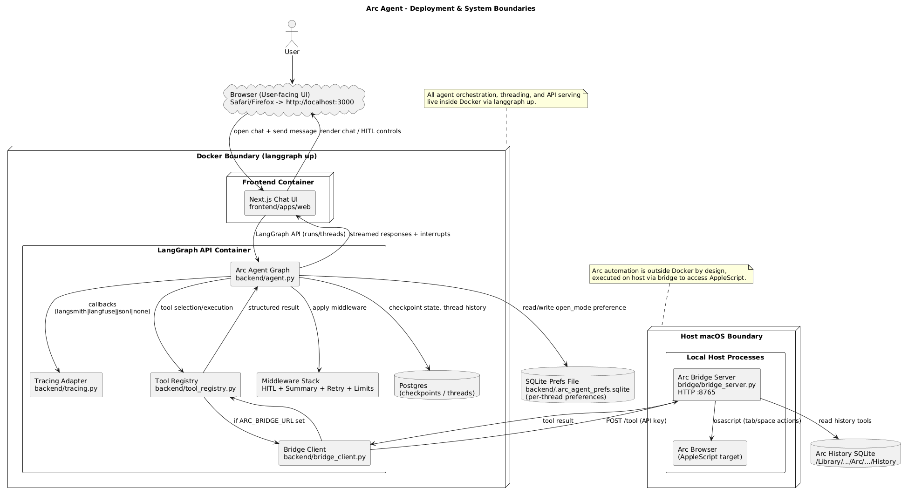
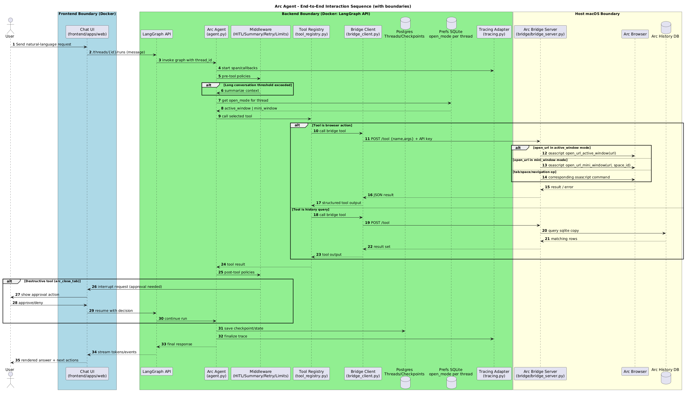
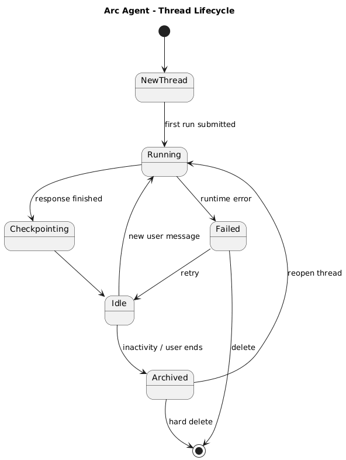
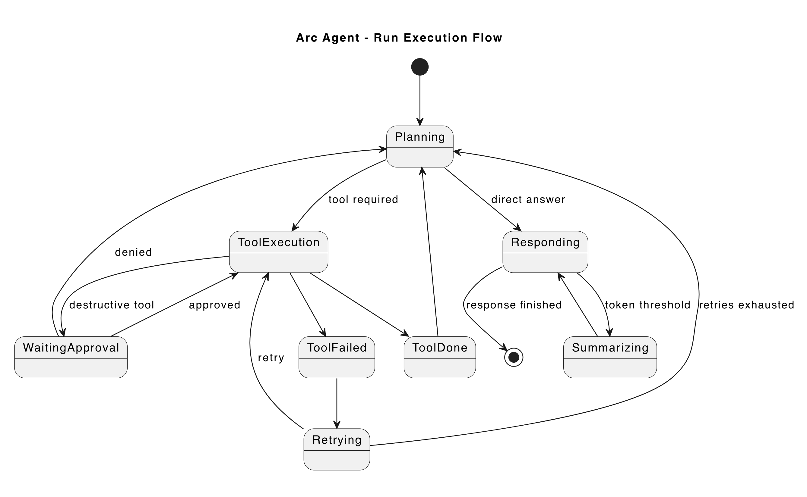
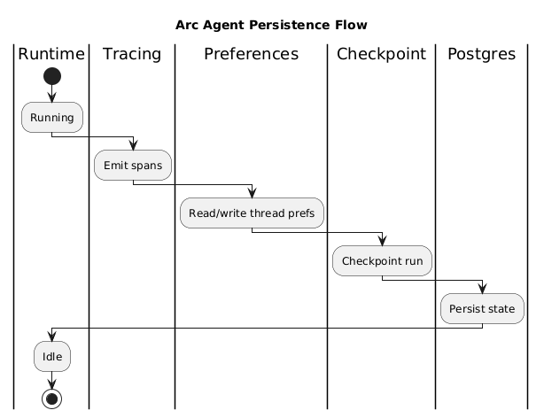

# Arc Agent

Natural-language Arc browser control on macOS using:

- Python backend (LangGraph + LangChain)
- Next.js chat frontend
- Host-local bridge for AppleScript tool execution

## What This Project Does

Arc Agent lets you chat with an agent that can:

- list spaces/tabs
- open/navigate/reload/switch/close tabs
- read page content
- query Arc history

The backend runs in LangGraph; browser automation runs on the host Mac through a bridge server, since AppleScript cannot execute Arc inside containers.

## Architecture

- `backend/`: LangGraph agent, tools, tracing, tool registry
- `bridge/`: host HTTP bridge that executes Arc tools locally
- `frontend/`: chat UI (Next.js)
- `docker/compose.yml`: frontend + postgres addon services

## Run Modes

### Full stack (recommended)

```bash
make stack-up
```

Starts:

- bridge (host process)
- LangGraph backend (`langgraph up`)
- frontend container
- postgres container

### Bring everything down

1. Press `Ctrl+C` in the terminal running `make stack-up` (stops bridge + backend process).
2. Run:

```bash
make compose-down
```

This stops frontend + postgres containers.

## Important Notes for `make stack-up`

You may see:

- `For local dev, requires env var LANGSMITH_API_KEY with access to LangSmith Deployment.`
- `For production use, requires a license key in env var LANGGRAPH_CLOUD_LICENSE_KEY.`

What this means:

- This message is emitted by the `langgraph up` runtime startup path.
- You can still use LangSmith tracing separately via your configured tracing backend.
- For this local project workflow, keep your required env vars in `.env` as documented in `.env.example`.

You may also see:

- `Security Recommendation: Consider switching to Wolfi Linux ...`

This is a recommendation, not a blocker. The current setup can run without switching image distro.

## Environment

Copy and fill environment values:

```bash
cp .env.example .env
```

Minimum keys to run:

- `OPENAI_API_KEY`
- `ARC_BRIDGE_API_KEY`
- `POSTGRES_URI_DOCKER` (or `POSTGRES_URI`)
- frontend vars (`NEXT_PUBLIC_API_URL`, `NEXT_PUBLIC_ASSISTANT_ID`) are prefilled with defaults

## Diagrams

### 1) Deployment and system boundaries



### 2) End-to-end interaction sequence



### 3) Thread lifecycle overview



### 4) Running state internal flow



### 5) Persistence responsibilities


