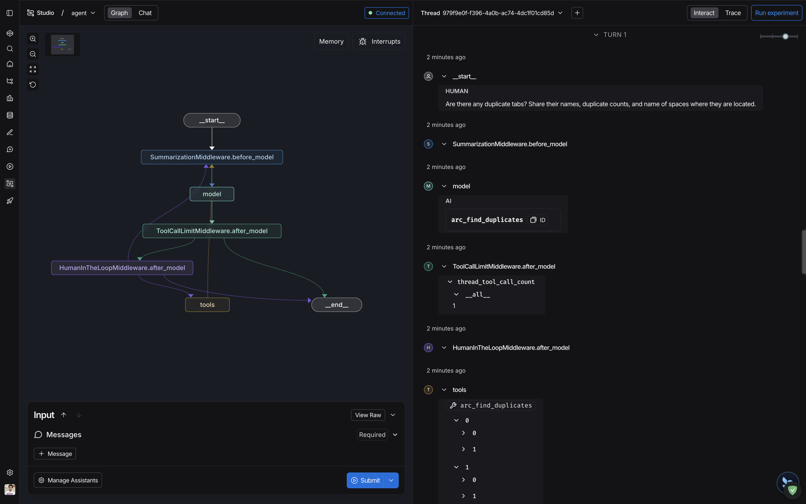
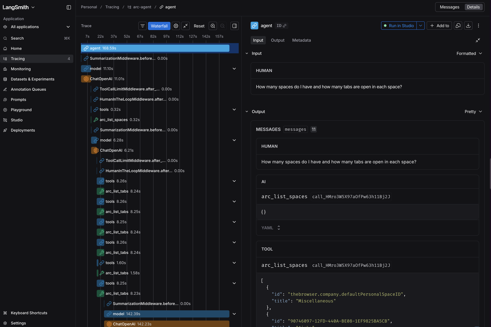
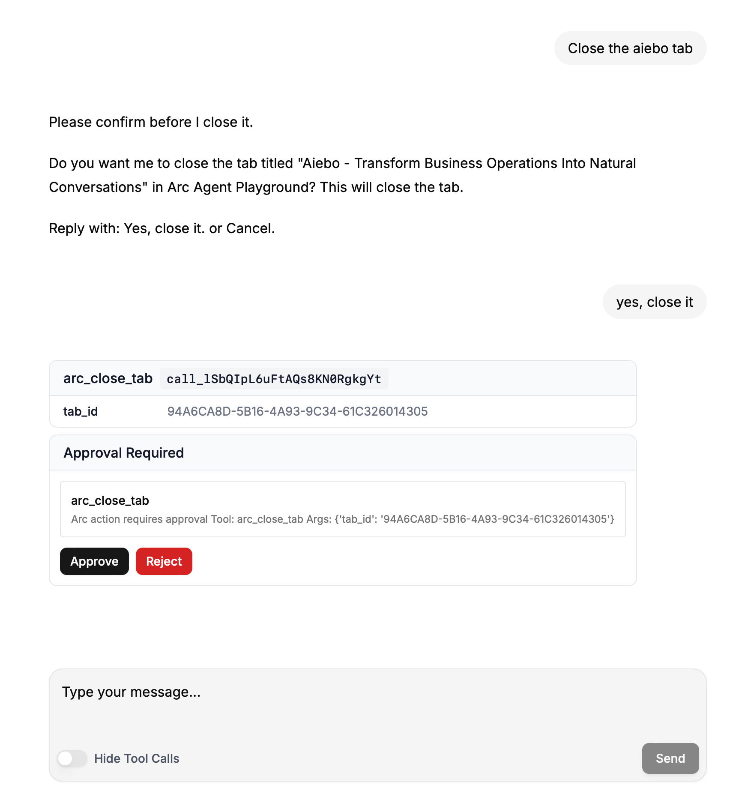
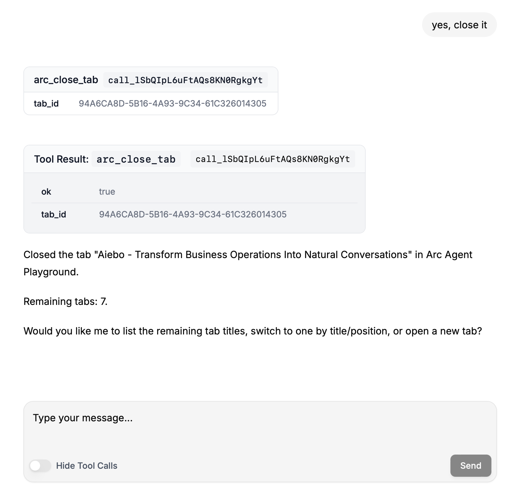
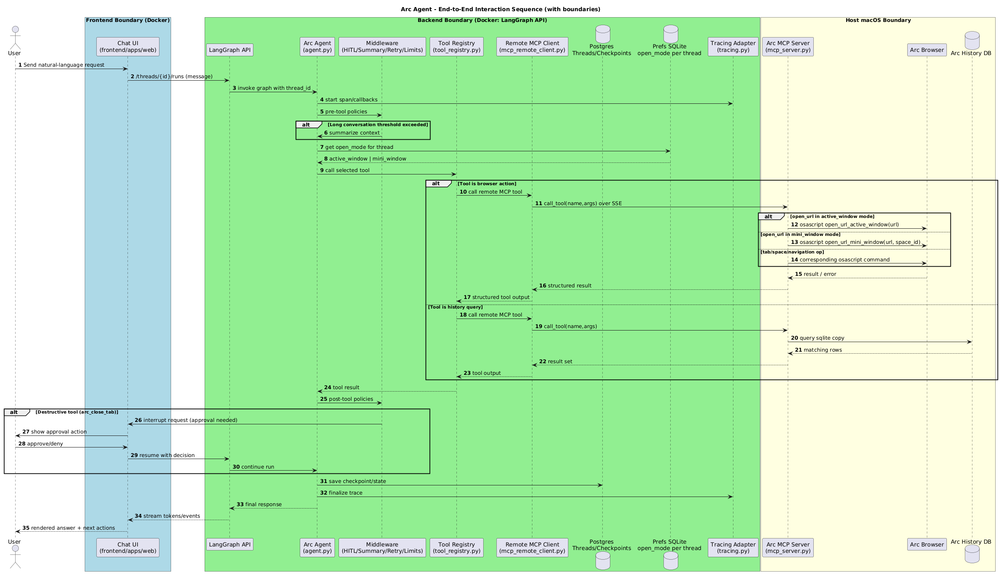

# Arc Agent

 [](LICENSE)  

> Chat with your Arc browser. Manage tabs, query your browsing history, and navigate the web — all through natural language.

## Why I Built This

If you use Arc heavily, you know the feeling: 100+ tabs spread across multiple spaces with no clear mental map of what's open or why. I kept wishing I could just *ask* — "What tabs do I have open about that side project?", "Close everything from last week's research sprint", "Find that article I was halfway through on distributed systems." Instead of hunting through spaces manually, Arc Agent lets you describe what you want in plain English and handles it.

Beyond tab triage, natural language unlocks a richer interface to your browser: summarise pages you haven't read yet, spot duplicates eating up space, rediscover things you browsed weeks ago, and surface patterns in how you actually spend time online — all without leaving a chat window.

## Screenshots






## What Arc Agent Can Do

- List spaces and tabs
- Open, navigate, reload, switch to, or close tabs
- Search tabs by title or URL
- Find duplicate tabs across spaces
- Read page content (for summarisation or Q&A)
- Query Arc browsing history and find recently closed tabs

## Prerequisites

> **macOS only.** Arc Agent uses AppleScript (`osascript`) to automate Arc browser, which is unavailable on other platforms.

| Requirement | Notes |
|---|---|
| macOS | Required for Arc + AppleScript |
| [Arc browser](https://arc.net) | The browser being controlled |
| [Docker Desktop](https://www.docker.com/products/docker-desktop/) | Runs the LangGraph backend + frontend |
| Python 3.12+ with [uv](https://docs.astral.sh/uv/) | `brew install uv` |
| Node.js 18+ with [pnpm](https://pnpm.io) | `npm i -g pnpm` (frontend dev only) |
| OpenAI API key | Required for the agent LLM |

## Architecture

- `backend/`: LangGraph agent, tools, tracing, tool registry
- `backend/mcp_server.py`: host MCP server that executes Arc tools locally via AppleScript
- `frontend/`: chat UI (Next.js)
- `docker/compose.yml`: frontend + postgres addon services

The backend runs in Docker via LangGraph; browser automation runs on the host Mac through an MCP server over SSE, since AppleScript cannot execute inside containers.

See [backend/README.md](backend/README.md) for backend-specific architecture and diagrams.

## Run Modes

### Full stack (recommended)

```bash
make stack-up
```

Starts:

- host MCP server (SSE transport)
- LangGraph backend (`langgraph up`)
- frontend container
- postgres container

### Dev mode (no license checks)

```bash
make stack-dev
```

Uses `langgraph dev` instead of `langgraph up` — no LangSmith deployment license required, non-persistent checkpoints.

### Bring everything down

1. Press `Ctrl+C` in the terminal running `make stack-up` (stops host MCP server + backend).
2. Run:

```bash
make compose-down
```

This stops the frontend + postgres containers.

<details>
<summary>Notes on startup output</summary>

You may see:

- `For local dev, requires env var LANGSMITH_API_KEY with access to LangSmith Deployment.`
- `For production use, requires a license key in env var LANGGRAPH_CLOUD_LICENSE_KEY.`

These are emitted by the `langgraph up` runtime startup path. You can still use LangSmith tracing separately via your configured tracing backend. Keep your required env vars in `.env` as documented in `.env.example`.

You may also see:

- `Security Recommendation: Consider switching to Wolfi Linux ...`

This is a recommendation, not a blocker.

</details>

## Environment

```bash
cp .env.example .env
```

**Minimum required keys:**

| Variable | Description |
|---|---|
| `OPENAI_API_KEY` | Your OpenAI API key |
| `POSTGRES_URI_DOCKER` | Postgres connection URI reachable from Docker (default provided in `.env.example`) |
| `ARC_MCP_SSE_URL_DOCKER` | MCP server URL reachable from Docker (default provided) |

The frontend vars (`NEXT_PUBLIC_API_URL`, `NEXT_PUBLIC_ASSISTANT_ID`) are prefilled with working defaults.

<details>
<summary>All environment variables</summary>

**LLM**

| Variable | Default | Description |
|---|---|---|
| `LLM_MODEL` | `gpt-5-nano` | Main agent model |
| `SUMMARY_MODEL` | `gpt-4.1-mini` | Model used for context summarisation |
| `SUMMARY_TRIGGER_TOKENS` | `12000` | Token count that triggers summarisation |
| `SUMMARY_TRIGGER_MESSAGES` | `80` | Message count that triggers summarisation |
| `SUMMARY_KEEP_MESSAGES` | `30` | Messages to keep after summarisation |
| `TOOL_CALL_THREAD_LIMIT` | `200` | Max tool calls per thread lifetime |
| `TOOL_CALL_RUN_LIMIT` | `40` | Max tool calls per single run |

**Postgres**

| Variable | Description |
|---|---|
| `POSTGRES_URI` | Local Postgres URI (used by `make backend-dev`) |
| `POSTGRES_URI_DOCKER` | Docker-network Postgres URI (used by `make stack-up`) |

**Arc MCP Server**

| Variable | Default | Description |
|---|---|---|
| `ARC_MCP_HOST` | `127.0.0.1` | Host the MCP server binds to |
| `ARC_MCP_PORT` | `8765` | Port the MCP server listens on |
| `ARC_MCP_TRANSPORT` | `sse` | Transport: `stdio`, `sse`, or `streamable-http` |
| `ARC_MCP_SSE_URL` | `http://127.0.0.1:8765/sse` | MCP SSE URL for local (non-Docker) mode |
| `ARC_MCP_SSE_URL_DOCKER` | `http://host.docker.internal:8765/sse` | MCP SSE URL reachable from Docker containers |

**Preferences**

| Variable | Default | Description |
|---|---|---|
| `PREFERENCES_DB_PATH` | `.arc_agent_prefs.sqlite` | Path to the per-thread preferences SQLite file |

</details>

<details>
<summary>Tracing setup (LangSmith / Langfuse / local JSONL / none)</summary>

Set `TRACING_BACKEND` to one of: `langsmith`, `langfuse`, `jsonl`, `none`.

**LangSmith** (default)

```env
TRACING_BACKEND=langsmith
LANGSMITH_API_KEY=your_key
LANGSMITH_PROJECT=arc-agent
LANGSMITH_TRACING=true
```

Get a key at [smith.langchain.com](https://smith.langchain.com). For the EU instance, add `LANGSMITH_ENDPOINT=https://eu.api.smith.langchain.com`.

**Langfuse**

```env
TRACING_BACKEND=langfuse
LANGFUSE_PUBLIC_KEY=your_key
LANGFUSE_SECRET_KEY=your_key
LANGFUSE_HOST=https://cloud.langfuse.com
```

**Local JSONL** (no external service)

```env
TRACING_BACKEND=jsonl
TRACE_JSONL_PATH=./backend/traces/agent-runtime.jsonl
```

**Disabled**

```env
TRACING_BACKEND=none
```

</details>

## Troubleshooting

### Arc tools fail or return permission errors

Arc Agent uses AppleScript via `osascript`. Your terminal application must have Accessibility access granted in macOS.

1. Open **System Settings → Privacy & Security → Accessibility**
2. Click `+` and add your terminal app (Terminal, iTerm2, Warp, Ghostty, etc.)
3. Restart the terminal and re-run `make stack-up`

If you launch the MCP server from a different shell host, grant access to that application instead.

### Bridge port already in use

```bash
make bridge-stop
```

Then retry `make stack-up`.

### Docker container cannot reach the MCP server

Ensure `ARC_MCP_SSE_URL_DOCKER=http://host.docker.internal:8765/sse` is set in `.env`. Docker Desktop on macOS resolves `host.docker.internal` to the host machine automatically.

## Contributing

Contributions are welcome.

1. Fork the repo and create a branch: `git checkout -b my-feature`
2. Make your changes
3. Run linting: `make lint`
4. Open a pull request with a clear description of what changed and why

For larger changes, open an issue first to align on the approach before investing time in implementation.

**Use Safari or Firefox during development** — never Arc itself, as the agent controls Arc and could close the tab you're working in.

## Security

This project is designed for personal/local use on a trusted machine. In that mode, many SaaS-style hardening controls are optional because:

- the Arc automation surface is your own host
- services run on localhost/private Docker network
- there is no multi-tenant user model

If you expose this beyond personal local use (shared network, remote access, cloud VM), add security controls first:

- app-level authentication and authorization for MCP/API access
- strict network allowlists/ACLs (least privilege)
- private connectivity (e.g. Tailscale/VPN) instead of public exposure
- TLS termination and secret management
- request rate limits, audit logging, and credential rotation
- non-root containers and hardened runtime images (e.g. Wolfi)

## System Diagrams

### 1) Deployment and system boundaries


### 2) End-to-end interaction sequence



Backend-specific diagrams (thread lifecycle, internal running flow, persistence responsibilities) are in [backend/README.md](backend/README.md).

## License

MIT — see [LICENSE](LICENSE).
