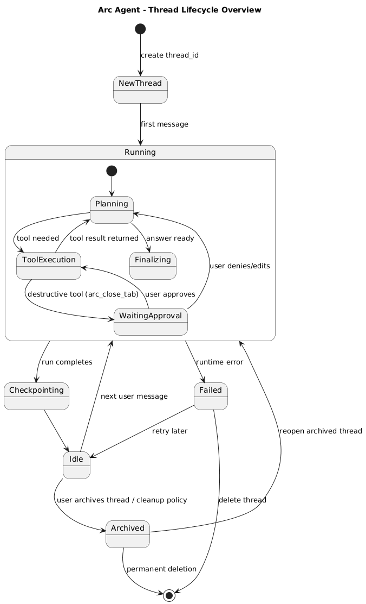
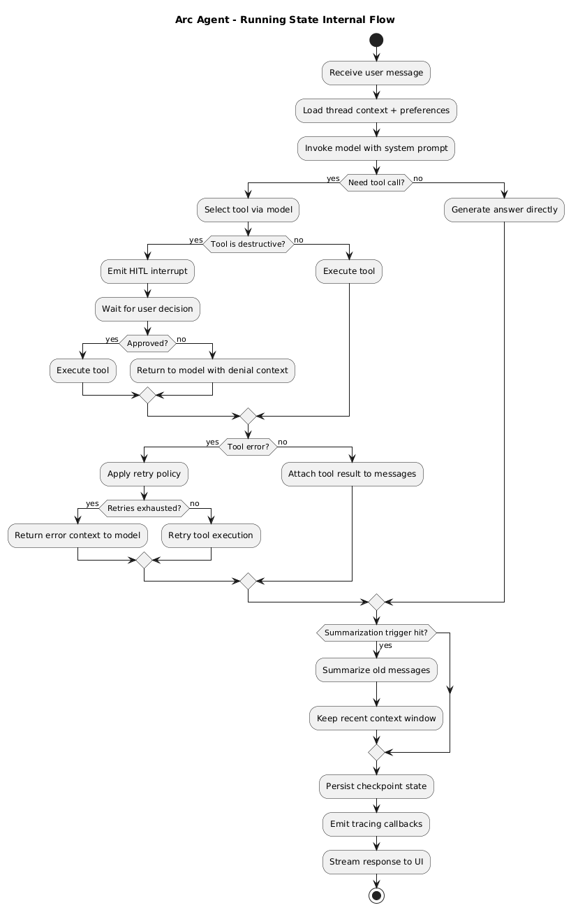
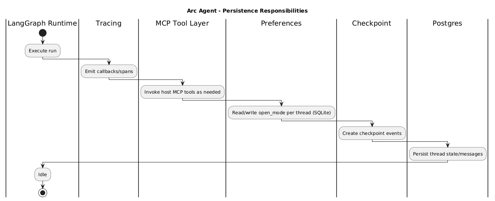

# Backend

This folder contains the Arc Agent backend runtime, tool routing, and MCP server.

## Scope

`backend/` includes:

- `agent.py`: LangGraph agent definition, middleware, prompt, tool assembly.
- `tool_registry.py`: shared tool wrappers used by both LangGraph and MCP server.
- `mcp_server.py`: FastMCP server exposing Arc tools.
- `mcp_remote_client.py`: client used by backend runtime to call host MCP over SSE.
- `tools/arc.py`: AppleScript-based Arc browser tool implementations.
- `tools/history.py`: Arc history SQLite query tools.
- `tracing.py`: tracing backend adapter (`langsmith|langfuse|jsonl|none`).
- `langgraph.json`: LangGraph API server graph config.

## Runtime Model

1. User sends message from frontend.
2. LangGraph API invokes `agent.py` graph.
3. Agent selects tools through `tool_registry.py`.
4. In containerized mode, registry calls host MCP server through `mcp_remote_client.py`.
5. Host MCP server executes Arc tools (AppleScript + history reads) and returns results.
6. Agent applies middleware (HITL, summary, retry, tool limits), persists checkpoint, and streams response.

## Tool Routing

`tool_registry.py` supports two execution modes:

- Local direct mode: calls `tools/*` functions directly when remote MCP URL is not set.
- Remote MCP mode: when `ARC_MCP_SSE_URL` is set, calls tools by name over MCP SSE transport.

This keeps one shared tool contract across:

- internal LangGraph agent execution
- external MCP clients

## Persistence

- Thread/checkpoint persistence (runtime): Postgres (with `langgraph up` path).
- Preference persistence (agent-level): SQLite file via `PREFERENCES_DB_PATH`.

## Key Environment Variables

- `OPENAI_API_KEY`
- `LLM_MODEL`
- `TRACING_BACKEND`
- `POSTGRES_URI` / `POSTGRES_URI_DOCKER`
- `ARC_MCP_SSE_URL` / `ARC_MCP_SSE_URL_DOCKER`
- `PREFERENCES_DB_PATH`

## Backend Diagrams

The canonical PlantUML sources are in `docs/script/puml/` and generated PNGs are in `docs/script/diagrams/`.

Overall system diagrams are documented in the root [README.md](/Users/dipesh/Local-Projects/arc-agent/README.md).

### Thread lifecycle overview

- Source: [aa-thread-lifecycle-overview.puml](/Users/dipesh/Local-Projects/arc-agent/docs/script/puml/aa-thread-lifecycle-overview.puml)
- PNG: 

### Running state internal flow

- Source: [aa-running-state-internal-flow.puml](/Users/dipesh/Local-Projects/arc-agent/docs/script/puml/aa-running-state-internal-flow.puml)
- PNG: 

### Persistence responsibilities

- Source: [aa-responsibilities.puml](/Users/dipesh/Local-Projects/arc-agent/docs/script/puml/aa-responsibilities.puml)
- PNG: 
